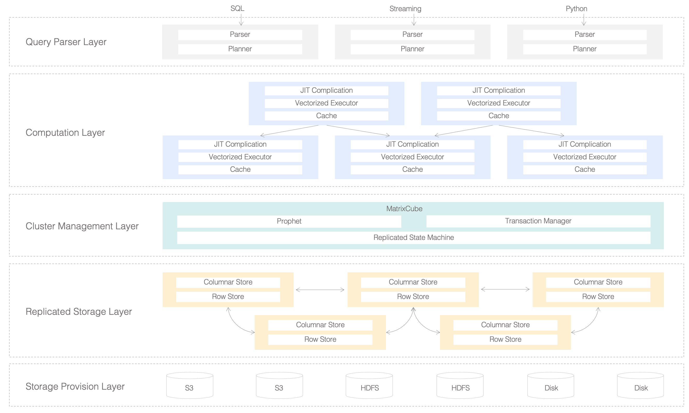

{ loading=lazy }

### Query Parser Layer
-   **Parser**: Parses SQL, Streaming Query, or Python language into an abstract syntax tree for further processing.
-   **Planner**: Finds the best execution plan through rule-based, cost-based optimization algorithms, and transfers abstract syntax tree to plan tree.
-   **IR Generator**: Converts Python code into an intermediate representation.
### Computation Layer
-   **JIT Compilation**: Turns SQL plan tree or IR code into a native program using LLVM at runtime.
-   **Vectorized Execution**: MatrixOne leverages SIMD instructions to construct vectorized execution pipelines.
-   **Cache**: Multi-version cache of data, indexes, and metadata for queries.
### Cluster Management Layer
MatrixCube is a fundamental library for building distributed systems, which offers guarantees about reliability, consistency, and scalability. It is designed to facilitate distributed, stateful application building to allow developers only need to focus on the business logic on a single node. MatrixCube is currently built upon multi-raft to provide replicated state machine and will migrate to Paxos families to increase friendliness to scenarios spanning multiple data centers.
-   **Prophet**: Used by MatrixCube to manage and schedule the MatrixOne cluster.
-   **Transaction Manager**: MatrixOne supports distributed transaction of snapshot isolation level.
-   **Replicated State Machine**: MatrixOne uses RAFT-based consensus algorithms and hyper logic clocks to implement strong consistency of the clusters. Introduction of more advanced state-machine replication protocols is yet to come.
### Replicated Storage Layer
-   **Row Storage**: Stores serving workload, metadata, and catalog.
-   **Column Storage**: Stores analytical workload and materialized views.
### Storage Provision Layer
MatrixOne stores data in shared storage of S3 / HDFS, or the local disk, on-premise server, hybrid and any cloud, or even smart devices.
